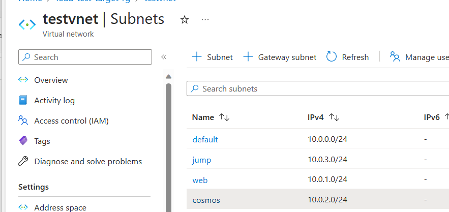
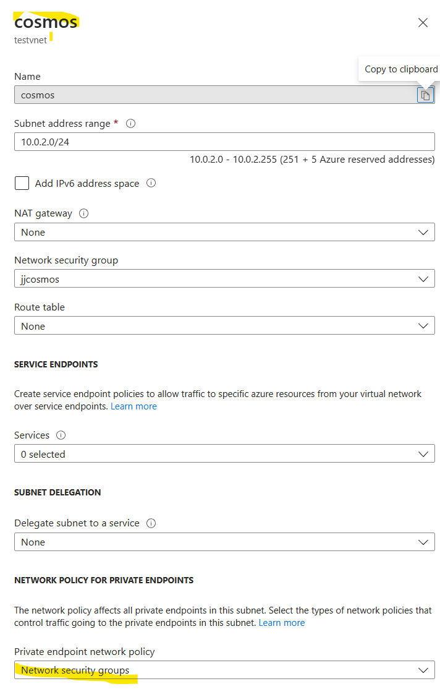
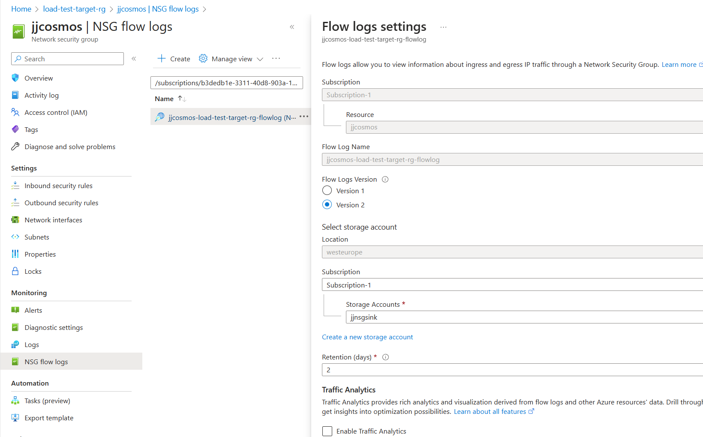
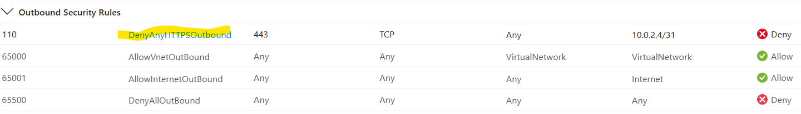
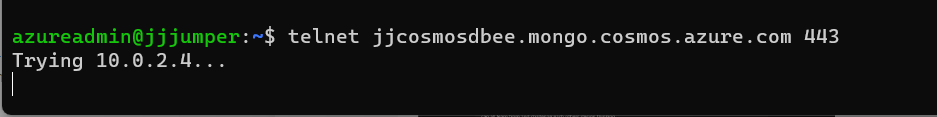
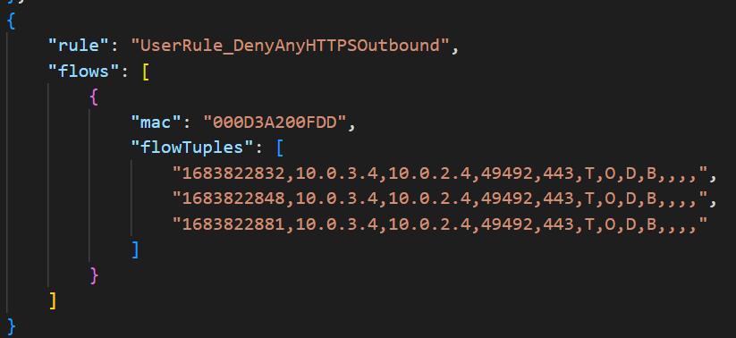

# Database Chaos Experiments

## Chaos Engineering
Chaos engineering is a discipline where experiments are run to deliberately disrupt a service in order to see how that service survives a disruption.

Azure Chaos Studio is an Azure service that allows chaos experiments to be run in a controlled and repeatable manner. These experiments have "fault actions" that can disrupt a specific service - some of these are at control-plane level and some of these are VM-based which use an agent on the VM.

## Chaos Studio Limitations
There are, however, a number of Azure services that that do not directly have a fault and are not built on accessible virtual machines and so cannot use the agent approach. 

This situation will improve over time, but as it currently stands in mid-2023, there are a number of services that do not directly have a chaos fault.

## The use of Network Security Groups (NSG)
This repo describes the use of network faults (more specifically NSG faults) as a means of creating an experiment that can block access to a resource - as a proxy for that service having a fault. In this manner, you can build an experiment that simulates the failure of a service by blocking access to that service via a network security group (NSG). It should be made clear, the target service will still be running, but access to that service will be blocked at the network level.

## Database Chaos
There are no Azure SQL Database or Cosmos Database chaos faults and so this approach can be used for chaos experiments on a database. That is blocking an application from being able to access a database.

## Other Use Cases
This technique may also be used to simulate the failure of other services too - not just databases. So long as they have some presence on a virtual network and so can have NSGs applied to them.

# Demonstration Application
The demonstration application is a very simple web API hosted in Azure App Services connecting to a Cosmos Database. Both of these services are configured to use a virtual network (VNet) - this VNet configuration is often used to limit access at the network level to Azure services. The API hosted in an app service, uses the app service VNet integration feature. The Cosmos database uses a private endpoint to restrict access to the database from clients in the same or a peered VNet.

Almost any web API that uses a database backend, but [here](https://github.com/Azure-Samples/nodejs-appsvc-cosmosdb-bottleneck) is a sample app that would work well for this demonstration.

In the following sections, this application can then be VNet integrated to allow the use of the [Chaos Studio NSG Fault](https://learn.microsoft.com/en-us/azure/chaos-studio/chaos-studio-fault-library#network-security-group-set-rules)

## Subnets

The above subnets are just some samples. In our demonstration, the cosmos database private endpoint is in the "cosmos" subnet and the web app is VNet integrated into the "web" subnet.

## Cosmos subnet private endpoint policy

This configuration is really important. 

 **_Private endpoints do not respect network security rules unless the private endpoint policy is set. What this means is that, unless this value is set, the NSG rules set, will be ignored by the private endpoint._**

A sample is below:

# Chaos Experiment
## Chaos Experiment with NSG fault

## Fault details

## Fault Permissions for NSG

## Fault running

## Impact on NSG rules for Cosmos database subnet

## Flow log setting

# Troubleshooting

This section is about how to troubleshoot that is happening when the NSG fault is running.

## Jump box subnet NSG block HTTPS
Firstly, you should establish that a new rule gets created when the NSG fault is running and that this is a deny rule for the correct source and targets.

Above is a sample of a new NSG rule having been created during the run. This rule will disappear once the chaos experiment completes.

## Telnet to Cosmos database
In order to establish the effectiveness of a deny NSG rule, then it is often useful to have some means of debugging this. This cannot easily be done form the application code, so one suggestion is to use a virtual machine in the same VNet to test connectivity to the database.

In the above image, a telnet commannd using the correct port (443 for Cosmos database and potentially 1433 for an Azure SQL Database). You can see that a connection has not been made and will time out at some point. If the connection is not blocked, you will see a response from the service. Bear in mind that this may differ depending on whether you are using an NSG deny rule inbound to the database (in our case "cosmos") subnet or are using an NSG deny rule outbound from the web subnet. In the case of a jumpbox, this is likely to be in its own subnet, so will not be impacted by an outbound deny NSG rule from the web subnet.

## Flow log from telnet in jump box

# The Utility of using an NSG as a proxy for other infrastructure faults

The NSG approach works to block access to the Cosmos database from requests eminating from the web app.

There is, however, one major caveat. NSG deny rules only take effect on new network flows. So, if there is a connection already open between the web app, the NSG deny rule will not come into effect until the web app attempts to open a new connection. Further investigation is needed to see how connection pooling in applications can impact the effectiveness of the use of NSGs on a running application that may use connection pooling.
