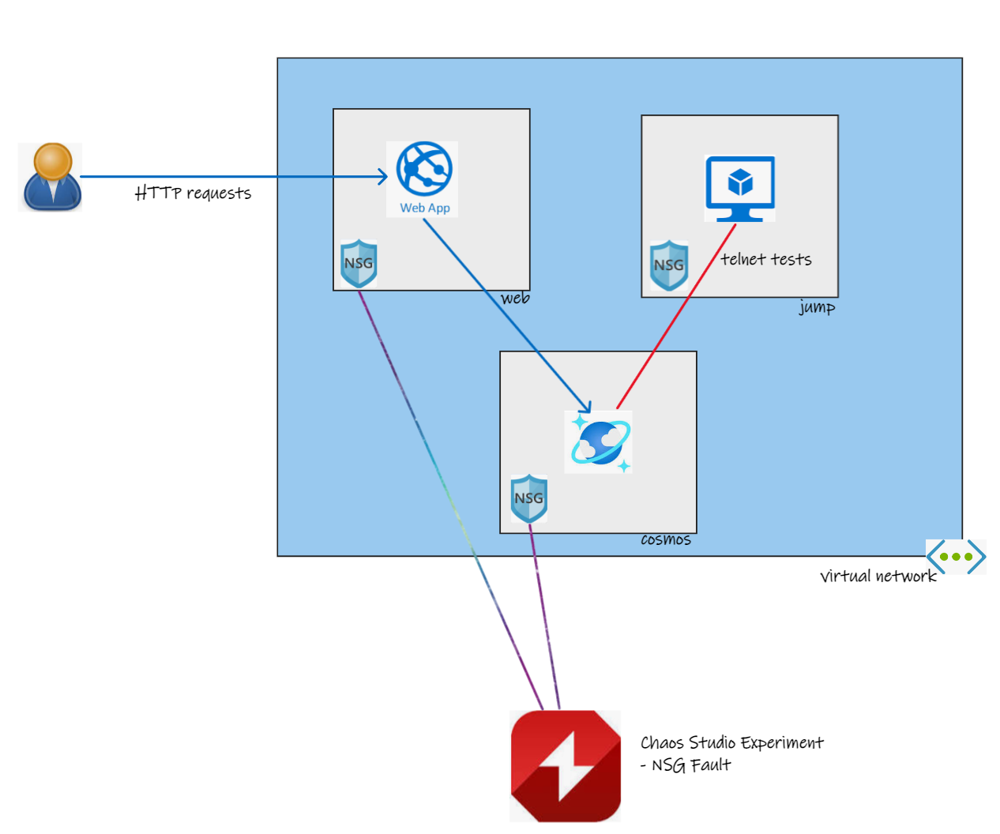
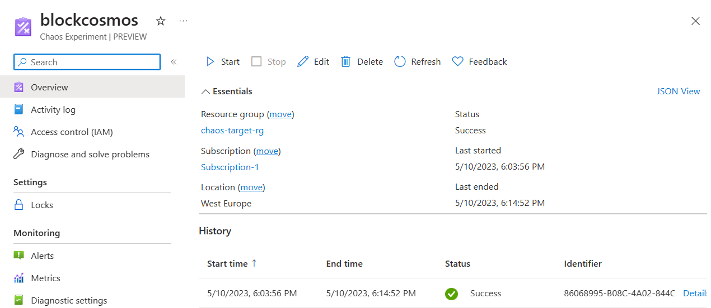
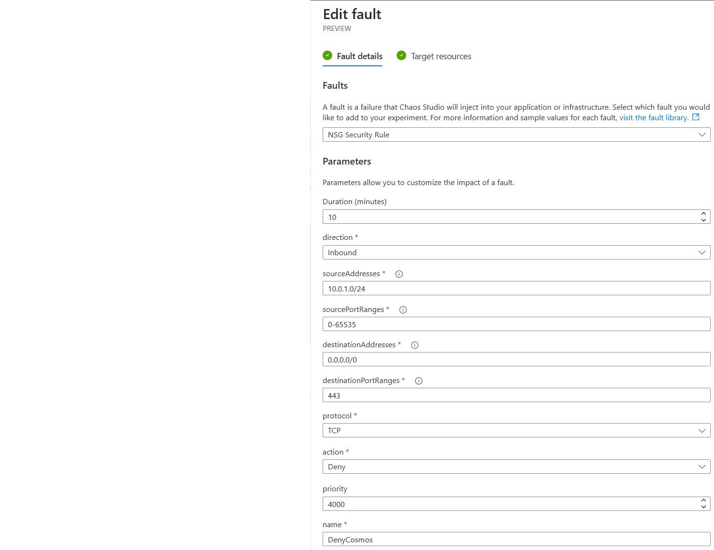
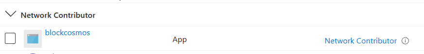
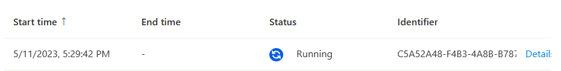
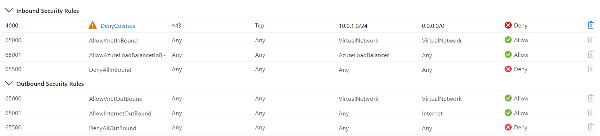

# Database Chaos Experiments

## Chaos Engineering
Chaos engineering is a discipline where experiments are run to deliberately disrupt a service in order to see how that service survives a disruption.

Azure Chaos Studio is an Azure service that allows chaos experiments to be run in a controlled and repeatable manner. These experiments have "fault actions" that can disrupt a specific service - some of these are at control-plane level and some of these are VM-based which use an agent on the VM.

## Chaos Studio Limitations
There are, however, a number of Azure services that that do not directly have a fault and are not built on accessible virtual machines and so cannot use the agent approach. 

This situation will improve over time, but as it currently stands in mid-2023, there are a number of services that do not directly have a chaos fault.

## The use of Network Security Groups (NSG)
This repo describes the use of network faults (more specifically NSG faults) as a means of creating an experiment that can block access to a resource - as a proxy for that service having a fault. In this manner, you can build an experiment that simulates the failure of a service by blocking access to that service via a network security group (NSG). It should be made clear, the target service will still be running, but access to that service will be blocked at the network level.

## Database Chaos
There are no Azure SQL Database or Cosmos Database chaos faults and so this approach can be used for chaos experiments on a database. That is blocking an application from being able to access a database.

## Other Use Cases
This technique may also be used to simulate the failure of other services too - not just databases. So long as they have some presence on a virtual network and so can have NSGs applied to them.

# Demonstration Application
The demonstration application is a very simple web API hosted in Azure App Services connecting to a Cosmos Database. Both of these services are configured to use a virtual network (VNet) - this VNet configuration is often used to limit access at the network level to Azure services.

# Chaos Experiment
## Chaos Experiment with NSG fault

## Fault details

## Fault Permissions for NSG

## Fault running

## Impact on NSG rules for Cosmos database subnet

