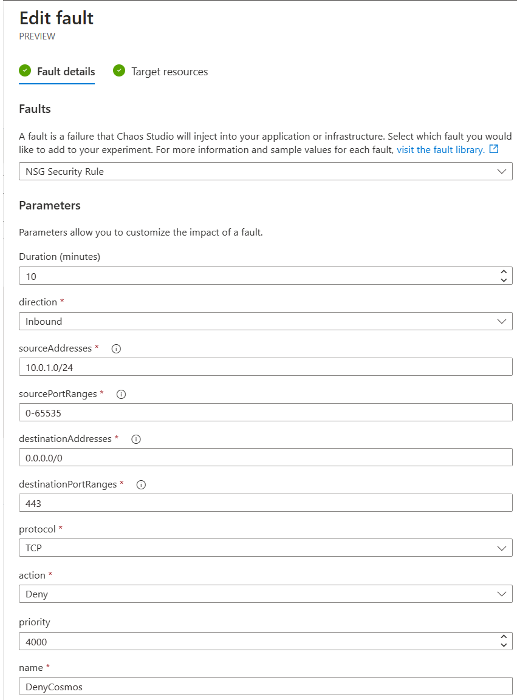
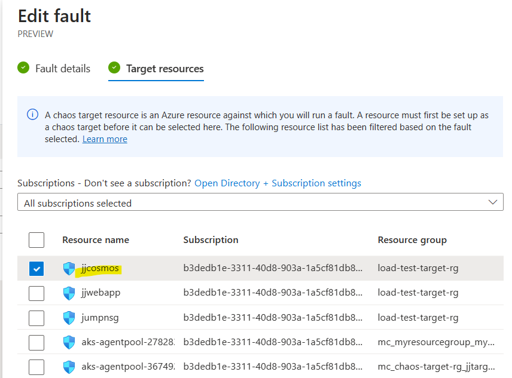
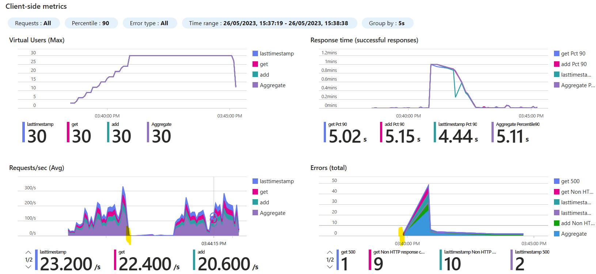

# Database Chaos Experiments

## Chaos Engineering
Chaos engineering is a discipline where experiments are run to deliberately disrupt a service in order to see how that service survives a disruption.

Azure Chaos Studio is an Azure service that allows chaos experiments to be run in a controlled and repeatable manner. These experiments have "fault actions" that can disrupt a specific service - some of these are at control-plane level and some of these are VM-based which use an agent on the VM.

## Chaos Studio Limitations
There are, however, a number of Azure services that that do not directly have a fault and are not built on accessible virtual machines and so cannot use the agent approach. 

This situation will improve over time, but as it currently stands in mid-2023, there are a number of services that do not directly have a chaos fault.

## The use of Network Security Groups (NSG)
This repo describes the use of network faults (more specifically NSG faults) as a means of creating an experiment that can block access to a resource - as a proxy for that service having a fault. In this manner, you can build an experiment that simulates the failure of a service by blocking access to that service via a network security group (NSG). It should be made clear, the target service will still be running, but access to that service will be blocked at the network level.

## Database Chaos
There are no Azure SQL Database or Cosmos Database chaos faults and so this approach can be used for chaos experiments on a database. That is blocking an application from being able to access a database.

## Other Use Cases
This technique may also be used to simulate the failure of other services too - not just databases. So long as they have some presence on a virtual network and so can have NSGs applied to them.

# Demonstration Application
The demonstration application is a very simple web API hosted in Azure App Services connecting to a Cosmos Database. Both of these services are configured to use a virtual network (VNet) - this VNet configuration is often used to limit access at the network level to Azure services. The API hosted in an app service, uses the app service VNet integration feature. The Cosmos database uses a private endpoint to restrict access to the database from clients in the same or a peered VNet.

Almost any web API that uses a database backend, but [here](https://github.com/Azure-Samples/nodejs-appsvc-cosmosdb-bottleneck) is a sample app that would work well for this demonstration.

In the following sections, this application can then be VNet integrated to allow the use of the [Chaos Studio NSG Fault](https://learn.microsoft.com/en-us/azure/chaos-studio/chaos-studio-fault-library#network-security-group-set-rules)

## Subnets

The above subnets are just some samples. In our demonstration, the cosmos database private endpoint is in the "cosmos" subnet and the web app is VNet integrated into the "web" subnet.

## Cosmos subnet private endpoint policy

This configuration is really important. 

 **_Private endpoints do not respect network security rules unless the private endpoint policy is set. What this means is that, unless this value is set, the NSG rules set, will be ignored by the private endpoint._**

A sample is below shows this setting highlighted:

# Chaos Experiment
## Chaos Experiment with NSG fault

Above shows the overview of a chaos experiment using NSGs.

## Fault details

As can be seen above, this is an NSG security fault that is a *Deny Inbound* on port 443 from the source IP range of 10.0.1.0/24 - which is the IP address range of the web subnet. So this rule will deny port 443 requests coming from the web app.

This is then associated with the jjcosmos network security group which is associated with the "cosmos" subnet in our sample.

There is an alternative approach to denying inbound to the cosmos subnet - to *Deny outbound* from web subnet for the web application. This is not quite so tidy but in terms of this chaos experiment, just as effective.

## Fault Permissions for NSG
As explained elsewhere, part of the security model of Chaos Studio, is to give the experiments *managed identities*. You therefore need to setup permissions to the NSG from the experiment.

In the above, the network security group allows the *blockcosmos* experiment to have *Network Contributor* access. If this not done, the experiment will fail to run.

## Fault running
The fault running in the portal. Make sure it gets to *Running* status.

## Impact on NSG rules for Cosmos database subnet
You can look at the NSG during the experiment run to see if a new rule has been added to the NSG that corresponds to the experiment.

In the above, you can see that a *DenyCosmos* rule has been added to the NSG.

## Impact on the application running
This is a chaos experiment and at some point requests from the web application to the Cosmos databases will be blocked by the NSG. This should cause some failure to be visible in the web application - or at least it should not continue to work.

Having done several runs, it can some time for failures to be noticed. It is believed that the could be because the application may connection pool to the database - an NSG rule change will only impact new network flows, not existing network flows.

# Troubleshooting
This section is about how to troubleshoot that is happening when the NSG fault is running.

## Jump box subnet NSG block HTTPS
Firstly, you should establish that a new rule gets created when the NSG fault is running and that this is a deny rule for the correct source and targets.

Above is a sample of a new NSG rule having been created during the run. This rule will disappear once the chaos experiment completes.

## Telnet to Cosmos database
In order to establish the effectiveness of a deny NSG rule, then it is often useful to have some means of debugging this. This cannot easily be done form the application code, so one suggestion is to use a virtual machine in the same VNet to test connectivity to the database.

In the above image, a telnet commannd using the correct port (443 for Cosmos database and potentially 1433 for an Azure SQL Database). You can see that a connection has not been made and will time out at some point. If the connection is not blocked, you will see a response from the service. Bear in mind that this may differ depending on whether you are using an NSG deny rule inbound to the database (in our case "cosmos") subnet or are using an NSG deny rule outbound from the web subnet. In the case of a jumpbox, this is likely to be in its own subnet, so will not be impacted by an outbound deny NSG rule from the web subnet.

## Flow log setting

## Flow log from telnet in jump box
[NSG Flow logs](https://learn.microsoft.com/en-us/azure/network-watcher/network-watcher-nsg-flow-logging-overview) is a troubleshooting mechanism whereby you can generate logs that are persisted to a storage account - so you verify the effect of a rule on the flow of a specific path.

In the above flow log, you can see a rule "UserRule_DenyAnyHttpsOutbound" being executed for a specific flow. So this is outbound from the "web" subnet where the app service is VNet integrated.

In terms of troubleshooting, these [considerations](https://learn.microsoft.com/en-us/azure/network-watcher/network-watcher-nsg-flow-logging-overview#considerations-for-nsg-flow-logs) states that NSG flow logs do not log across a private link. This means if you decided to put a deny flow log inbound to the Cosmos subnet (instead of outbound from the web subnet), then this flow log will not appear. So bear this in mind when attempting to debug a problem with NSG flow logs.

# Summary on the utility of using an NSG as a proxy for other infrastructure faults

The NSG approach works to block access to the Cosmos database from requests eminating from the web app. For this approach to work at all, the target of the chaos experiment needs to be in some way inside a VNet so an network security group can be attached to one of the subnets.

## Potential caveat
There is, however, one major caveat. By default, NSG deny rules only take effect on *new* network flows. So, if there is a connection already open between the web app, the NSG deny rule will not come into effect until the web app attempts to open a new connection. 

## Update from the Chaos Studio team
On further investigation, this has been seen with other use cases and there is a capability on NSGs where an [API call](https://learn.microsoft.com/en-us/dotnet/api/microsoft.azure.management.network.models.networksecuritygroup.flushconnection?view=azure-dotnet) may be used to cause the NSG rules to be evaulated. The chaos team are testing this out. On repeating a load test with this step, the NSG chaos rule does indead work as hoped for.

Above is a load test run where I have highlighted the point at which an NSG Deny chaos experiment has been started - this is using a preview version of this flush feature mentioned above.

This looks like a successful approach.
